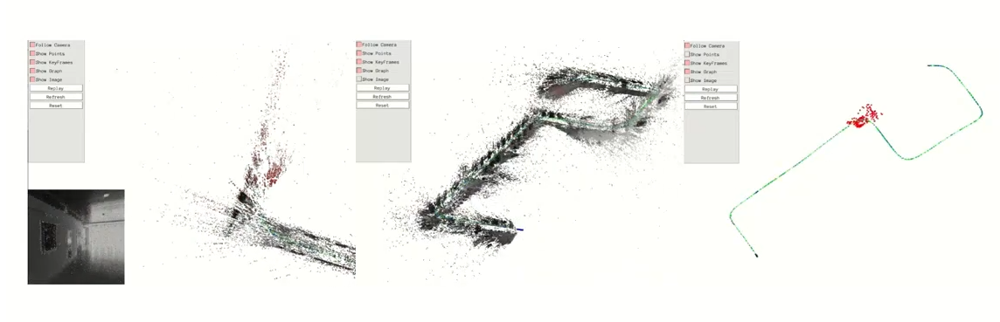

# DH-PTAM

This Python research project is the complete implementation of DH-PTAM.  

## Insights Video

Has our implementation inspired your research? Are you interested in using our code? If so, please cite our paper:

A. Soliman, F. Bonardi, D. Sidibé, and S. Bouchafa, "DH-PTAM: A Deep Hybrid Stereo Events-Frames Parallel Tracking And Mapping System," IEEE Transactions on Intelligent Vehicles, vol. 0, 2024, doi: 10.1109/TIV.2024.3412595. [Read the paper here](https://ieeexplore.ieee.org/document/10553268).

## Requirements
* Python 3.6+
* numpy
* numba
* hdf5plugin
* progress
* tqdm
* skimage
* scipy
* argparse
* cv2
* [g2o](https://github.com/uoip/g2opy) (Python binding of the C++ library [g2o](https://github.com/RainerKuemmerle/g2o)) for optimization
* [pangolin](https://github.com/uoip/pangolin) (Python binding of the C++ library [Pangolin](http://github.com/stevenlovegrove/Pangolin)) for visualization

## Usage
* The entry point where we select the dataset and DH-PTAM parameters:
`main_DH-PTAM.py`  
* Configuration of parameters:
`params.py`  
* Configuration of datasets (Set for MVSEC, TUM-VIE, and VECtor):
`dataset_config.py`  

## Results
Sample trajectories of some experiments are provided in:   
* `/DH_PTAM/results/save/`

## Credits
The backend of this project is based on:
* PySLAM: [https://github.com/luigifreda/pyslam](https://github.com/luigifreda/pyslam)
* S-PTAM: [https://github.com/uoip/stereo_ptam](https://github.com/uoip/stereo_ptam)
