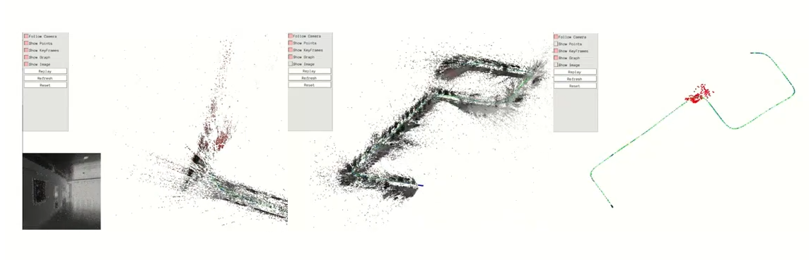

# DH-PTAM

This Python research project is the complete implementation of DH-PTAM.  

## Insights Video

[](https://youtu.be/chAC-vQH9KU)

Has our implementation inspired your research? Are you interested in using our code? If so, please cite our paper:

A. Soliman, F. Bonardi, D. Sidibé, and S. Bouchafa, "DH-PTAM: A Deep Hybrid Stereo Events-Frames Parallel Tracking And Mapping System," IEEE Transactions on Intelligent Vehicles, vol. 0, 2024, doi: 10.1109/TIV.2024.3412595. [Read the paper here](https://ieeexplore.ieee.org/document/10553268).

## Requirements
* Python 3.6+
* numpy
* numba
* hdf5plugin
* progress
* tqdm
* skimage
* scipy
* argparse
* cv2
* [g2o](https://github.com/uoip/g2opy) <sub>(Python binding of the C++ library [g2o](https://github.com/RainerKuemmerle/g2o))</sub> for optimization
* [pangolin](https://github.com/uoip/pangolin) <sub>(Python binding of the C++ library [Pangolin](http://github.com/stevenlovegrove/Pangolin))</sub> for visualization


## Build and Installation Process

### Step 1: Clone the Repository

```bash
git clone https://github.com/AbanobSoliman/DH-PTAM.git
cd DH-PTAM
````

### Step 2: Set Up Python Environment

> **It’s recommended to use a virtual environment**

```bash
# Using conda (recommended)
conda create -n dhptam python=3.8
conda activate dhptam

# OR using venv
python -m venv dhptam_env
source dhptam_env/bin/activate  # Linux/Mac
# dhptam_env\Scripts\activate    # Windows
```

### Step 3: Install Basic Dependencies

```bash
pip install numpy numba hdf5plugin progress tqdm scikit-image scipy opencv-python argparse
```

### Step 4: Install g2o (for optimization)

The g2o Python binding can be installed directly from PyPI:

```bash
pip install -U g2o-python
```

### Step 5: Install Pangolin (for visualization)

Pangolin requires building from source:

```bash
# Install system dependencies (Ubuntu/Debian example)
sudo apt-get install libglew-dev libboost-dev libboost-thread-dev libboost-filesystem-dev

# Clone and build Pangolin
git clone https://github.com/uoip/pangolin.git
cd pangolin
mkdir build
cd build
cmake ..
make -j8
cd ..
python setup.py install
cd ..
```

### Step 6: Install Deep Learning Features Dependencies

```bash
pip install torch torchvision
```

### Step 7: Download Pre‑trained Models

Create directories for the feature models:

```bash
mkdir -p features/hardnet
mkdir -p features/keynet
mkdir -p features/r2d2_old
```

Download and place the pre‑trained model files for:

* **SuperPoint** → `features/superpoint/`
* **HardNet** → `features/hardnet/`
* **KeyNet** → `features/keynet/`
* **R2D2** → `features/r2d2_old/`

(Refer to each project’s release page for download links.)

---

## Running DH‑PTAM

### Step 1: Configure Dataset Parameters

Edit `dataset_config.py` to adjust the paths to your datasets. Supported datasets:

* **MVSEC**: Multi‑Vehicle Stereo Event Camera
* **TUM‑VIE**: TUM Visual‑Inertial Event
* **VECtor**: Visual‑Event‑based dataset

### Step 2: Configure System Parameters

Review and update `params.py` to tweak system settings (e.g., image size, threshold values, etc.) based on your hardware and accuracy requirements.

### Step 3: Run the System

Use the main entry script:

```bash
python main_DH-PTAM.py \
  --dataset_type tum \
  --dataset_name mocap-desk2 \
  --feature R2D2
```

#### Command‑line Arguments

* `--dataset_type`: Dataset type (`tum`, `vector`, `mvsec`)
* `--dataset_name`: Sequence name (e.g., `mocap-desk2`)
* `--scale`: Motion scale (`1` for large-scale, `0` for small-scale)
* `--skip`: Number of initial frames to skip
* `--visualize`: Enable real-time visualization
* `--beta_lim`: Weight of event contributions to the standard camera frame
* `--dataset_path`: Path to your dataset root
* `--feature`: Feature extractor (`R2D2` or `SP` for SuperPoint)

---

## Dataset Support

* **MVSEC**: Multi‑Vehicle Stereo Event Camera dataset
* **TUM‑VIE**: TUM Visual‑Inertial Event dataset
* **VECtor**: Visual‑Event‑based dataset

> Download and place these datasets under the directory specified by `--dataset_path`.

---

## Visualization and Output

Trajectories and keyframe files are saved under `./results/`:

* `DH_PTAM_[dataset_name]_[timestamp].txt`
* `KFs_DH_PTAM_[dataset_name]_[timestamp].txt`

Sample results are provided in `./results/save/`.

---

## Common Issues and Troubleshooting

* **Missing dependencies**: Re-run `pip install …` to ensure all packages are present.
* **CUDA errors**: Check PyTorch–CUDA compatibility and your GPU drivers.
* **Dataset path errors**: Verify paths in `dataset_config.py`.
* **Feature model errors**: Ensure all pre‑trained models are downloaded and placed correctly.


## Results
Sample trajectories of some experiments are provided in:   
* `/DH_PTAM/results/save/`

## Credits
The backend of this project is based on:
* PySLAM: [https://github.com/luigifreda/pyslam](https://github.com/luigifreda/pyslam)
* S-PTAM: [https://github.com/uoip/stereo_ptam](https://github.com/uoip/stereo_ptam)
